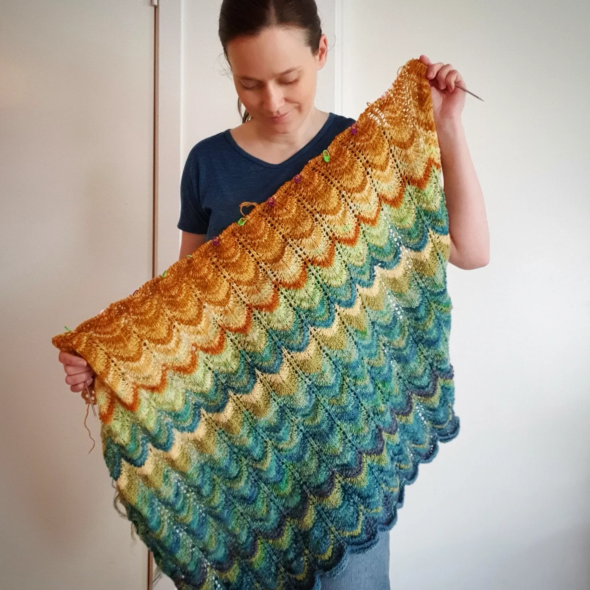
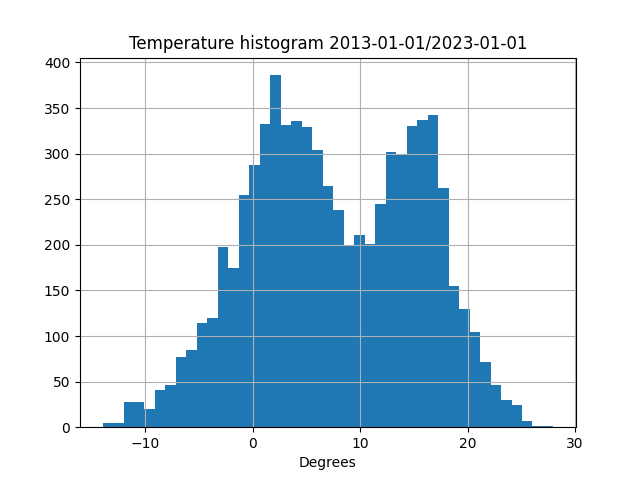

# Tepperatur

Scripts for retrieving daily weather data used for planning and creating a temperature blanket. 

The concept of a knitted or crocheted temperature blanket (or scarf, cardigan etc.) is to let daily temperatures dictate the color used for each row. 

## Requirements

- requests
- pandas
- matplotlib
- numpy
- datetime

## Getting started
These scripts use the Frost API from Metrologisk Institutt, and is based on the tutorial from https://frost.met.no/python_example.html. You must create a user at Frost to retrieve the data, as described here: https://frost.met.no/howto.html

When you have created a user, you can run histogram.py with your client ID, and get a histogram and percentile values of mean temperatures at Blindern in Oslo the last ten years. This can be used to plan the temperature range needed to cover the most probable temperatures during a year.

The script get_temperature_list can be modified to output a list of colors to knit each day.

## Example blanket

These scripts were used to plan and create the blanket in the picture above. I used 16 colors, with 2 degree bins ranging from -10 to 22 degrees celcius (1 and 99 percentile values).
The blanket knitting project is described on the project page on Ravelry: https://www.ravelry.com/projects/marythehill/tepperatur-2022
